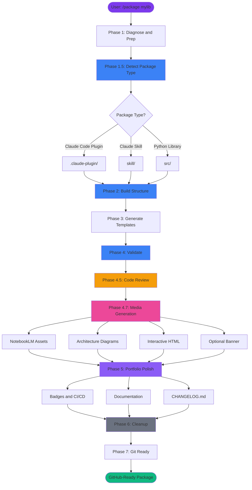

# github-ready

[](https://github.com/EndUser123/github-ready)
[](LICENSE)
[](https://github.com/EndUser123/github-ready)
[](https://github.com/EndUser123/github-ready/actions)

> Universal Package Creator and Portfolio Polisher v5.5.0

Create GitHub-ready Python libraries, Claude skills, and Claude Code plugins with badges, CI/CD workflows, coverage metrics, and media artifacts.

## Installation

### Three Deployment Models

**IMPORTANT**: This package supports three different deployment modes. Choose the right one for your use case.

#### 1. SKILLS (Dev Deployment) ⭐ **Recommended for Development**

**For**: When you're actively developing this package and want instant feedback.

**Setup:**
```powershell
# Windows (Junction - No admin required)
# For plugins with skills: Junction to the skills/ subdirectory
New-Item -ItemType Junction -Path "P:\.claude\skills\package" -Target "P:\packages\github-ready\skills\github-ready"

# macOS/Linux (Symlink)
ln -s /path/to/packages/github-ready/skills/github-ready ~/.claude/skills/package
```

**Key points:**
- ✅ Edit in `P:/packages/github-ready`, changes work immediately
- ✅ No reinstallation required - skills auto-discover from `P:/.claude/skills/`
- ✅ Perfect for active development
- ✅ Junction to `skills/github-ready/` subdirectory (where SKILL.md actually lives)
- ⚠️  **CRITICAL**: The junction target points to WHERE THE SKILL.md FILE ACTUALLY LIVES
  - Plugin skills: `package-name/skills/skill-name/SKILL.md` → junction target: `skills/skill-name/`

#### 2. HOOKS (Dev Deployment - Hook Files Only)

**For**: When this package has hook files (`.py` files in `core/hooks/`) you want to test.

**Setup:**
```powershell
# Symlink individual hook files to P:/.claude/hooks/
cd P:/.claude/hooks

# Example: Symlink a specific hook file
cmd /c "mklink HookName.py P:/packages/github-ready/core/hooks/HookName.py"
```

**Key points:**
- ✅ Symlink individual `.py` hook files only (NOT the entire directory)
- ✅ Symlinks go in `P:/.claude/hooks/` (NOT `~/.claude/plugins/`)
- ✅ These are dev-only symlinks for working directly on source code
- ⚠️  After brownfield conversion, check for broken symlinks pointing to old `src/` paths

#### 3. PLUGINS (End User Deployment)

**For**: Distributing this package to other users via marketplace or GitHub.

**Setup:**
```bash
# End users install via /plugin command
/plugin P:/packages/github-ready

# Or from marketplace (when published)
/plugin install github-ready
```

**Key points:**
- ✅ Plugin copied to `~/.claude/plugins/cache/`
- ✅ Registered in `~/.claude/plugins/installed_plugins.json`
- ❌ **NOT for local development** - requires reinstall on every change
- ✅ Use for distributing finished packages to users

### Which Model Should You Use?

| Your Situation | Use This Model | Why |
|----------------|----------------|-----|
| Actively developing this package | **SKILLS** (junction) | Instant feedback, no reinstall |
| Testing hook file changes | **HOOKS** (symlinks) | Direct hook testing |
| Distributing to end users | **PLUGINS** (/plugin) | Proper distribution format |

### Common Mistakes to Avoid

- ❌ Don't use `/plugin` command for local development (requires reinstall on every change)
- ❌ Don't symlink entire directories to `P:/.claude/hooks/` (only symlink `.py` files)
- ❌ Don't confuse skills (`P:/.claude/skills/`) with plugins (`~/.claude/plugins/`)
- ❌ Don't forget to update symlinks after brownfield conversion - check for `src/` paths

## Features

- 🎯 **Intelligent Detection**: Automatically detects package type and requirements from project structure
- 📦 **Multi-Format Support**: Creates Claude skills, Python libraries, and Claude Code plugins
- 🎨 **Portfolio Polish**: Adds badges, CI/CD, CHANGELOG, API docs, and media artifacts
- 🎬 **Media Generation**: Creates banners, diagrams, explainer videos, and presentations
- 🔍 **Code Review**: Automated quality validation before portfolio polish
- 🔄 **Brownfield Conversion**: Converts existing Python libraries to plugins

## Quick Start

```bash
# Create a new package (auto-detects type)
/github-ready mylib

# Polish existing repository
/github-ready --target P:/packages/existing-repo

# Preview what will happen
/github-ready --dry-run myproject
```

## What It Does

**One command → Full intelligent pipeline:**

1. **DETECT** — Scan repository, identify gaps and needs
2. **ANALYZE** — Determine package type automatically
3. **GENERATE** — Create all missing artifacts (structure, badges, CI/CD, docs, CHANGELOG)
4. **VALIDATE** — Verify everything works
5. **CLEANUP** — Detect and remove obsolete files from refactoring
6. **REPORT** — Show what was created with evidence

## Media Assets

> 💡 **Note**: These assets were generated using NotebookLM integration and automatically published to GitHub Releases for easy access.

### 🎙️ Explainer Video (22 seconds)

[](https://enduser123.github.io/github-ready/docs/video.html)

> **[🎬 Watch the explainer in the browser](https://enduser123.github.io/github-ready/docs/video.html)**  
> **[⬇️ Download the MP4 directly](https://github.com/EndUser123/github-ready/releases/download/media/github_ready_explainer_pbs.mp4)**
> *Browser playback requires GitHub Pages to be enabled for this repository.*

**Quick overview**: Features, workflow, and automated portfolio polish

---

### 📊 Architecture Diagrams

#### Complete Workflow



#### Static Diagrams


*High-level system overview generated by NotebookLM*

#### Interactive HTML Diagrams

**[🎨 Interactive Architecture Overview →](docs/github-ready-architecture.html)**
*Explore system components and data flow with pan & zoom*

**[🎨 Interactive Workflow Diagram →](docs/github-ready-workflow.html)**
*Enhanced interactive version with detailed phase breakdown*

---

### 📑 Presentation Slides

**[📄 View PDF in GitHub viewer](assets/slides/github_ready_slides.pdf)** | [📥 Download PDF](assets/slides/github_ready_slides.pdf) | [📊 Download PPTX (editable)](assets/slides/github-ready_slides.pptx)

---

### 🎨 Infographic


*Visual overview of the github-ready system architecture*

**[⬇️ Download PNG](assets/infographics/github_ready_notebooklm.png)**

---

### 📐 System Overview

```mermaid
graph TB
    Input[User: /github-ready mylib] --> Detect[Detect Package Type]

    Detect --> Type{Package Type?}

    Type -->|Claude Code Plugin| Plugin[Plugin Structure]
    Type -->|Claude Skill| Skill[Skill Structure]
    Type -->|Python Library| Library[Library Structure]

    Plugin --> Scaffold[Scaffolding and Generation]
    Skill --> Scaffold
    Library --> Scaffold

    Scaffold --> Polish[Portfolio Polish]

    Polish --> Badges[Badges and Metrics]
    Polish --> CI[CI/CD Workflows]
    Polish --> Docs[Documentation]
    Polish --> Media[Media Assets]

    Media --> Diagram[Architecture Diagrams]
    Media --> Video[Explainer Videos]
    Media --> Slides[Presentation Slides]

    Badges --> Quality[Quality Validation]
    CI --> Quality
    Docs --> Quality

    Quality --> Output[GitHub-Ready Package]

    style Input fill:#1f6feb
    style Output fill:#238636
    style Detect fill:#21262d
    style Scaffold fill:#21262d
    style Polish fill:#21262d
    style Quality fill:#21262d
```



*Interactive source:* [github-ready-architecture.html](docs/github-ready-architecture.html)

---

**💡 Tip**: PDFs open in GitHub's viewer with annotation support. PPTX files are editable for customizations.

## Package Types

| Type | Trigger | Structure | Use Case |
|------|---------|-----------|----------|
| **Claude Code Plugin** | `.claude-plugin/` directory | `.claude-plugin/` + `core/` + `hooks/` | **DEFAULT**: Packages with hooks/skills |
| **Claude Plugin + MCP** | `.claude-plugin/` + MCP server | Adds `.mcp.json` | Plugins with MCP server |
| **Brownfield Plugin** | Python library + conversion | `src/` → `core/` migration | Convert existing Python lib |
| **Python Library** | `src/` or `pyproject.toml` | `src/{{NAME}}/` + `tests/` | Pure backend code (no hooks) |
| **Claude Skill** | `SKILL.md` exists | `skill/` only | Standalone Claude skills |

## Contributing

Contributions are welcome! Please see [CONTRIBUTING.md](CONTRIBUTING.md) for guidelines.

## Changelog

See [CHANGELOG.md](CHANGELOG.md) for version history and updates.

## License

MIT License - see [LICENSE](LICENSE) for details.

## Resources

- [NotebookLM Video Workflow](NOTEBOOKLM_VIDEO_WORKFLOW.md) - Guide for creating explainer videos
- [templates/](templates/) - Template files for various package elements
- [Video Workflow Template](templates/video-section-template.md) - Copy-paste template for README videos

---

**github-ready** - Create portfolio-worthy Python packages, skills, and plugins
