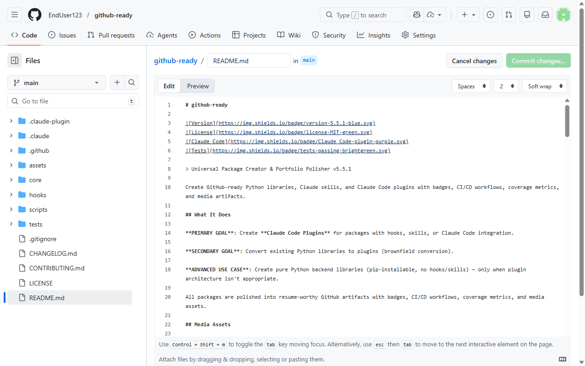

# gitready

[](https://github.com/EndUser123/gitready)
[](LICENSE)
[](https://github.com/EndUser123/gitready)
[](https://github.com/EndUser123/gitready/actions)

> Universal Package Creator and Portfolio Polisher v5.15.2

Create GitHub-ready Python libraries, Claude skills, and Claude Code plugins with badges, CI/CD workflows, coverage metrics, media artifacts, and automated GitHub publication.


## Quick Start

```bash
# Create a new package (auto-detects type)
/gitready mylib

# Polish existing repository
/gitready --target P:/packages/existing-repo

# Preview what will happen
/gitready --dry-run myproject
```

## See The Transformation

gitready transforms a rough project into a polished GitHub-ready package:

| Aspect | Before | After |
|--------|--------|-------|
| **Documentation** | Missing or minimal README | Full README with badges, install guide, usage |
| **CI/CD** | No workflows | GitHub Actions with pytest, coverage, linting |
| **Versioning** | Manual | Automated CHANGELOG generation |
| **Badges** | None | Version, License, Tests, Coverage badges |
| **Media** | None | Architecture diagram, explainer video, slides |
| **Publication** | Local only | Automated GitHub repo creation and release |

**Before:**

```
my-package/
  my_module.py
  README.md (minimal)
```

**After:**

```
my-package/
  my_module.py
  README.md (polished with badges + media)
  CHANGELOG.md (auto-generated)
  CONTRIBUTING.md
  LICENSE
  .github/
    workflows/
      ci.yml
      release.yml
  assets/
    videos/
    slides/
    banners/
  docs/
    video.html (GitHub Pages player)
```


## Explainer Video

[](https://enduser123.github.io/gitready/docs/video.html)

> **[🎬 Watch the explainer in the browser](https://enduser123.github.io/gitready/docs/video.html)**
> **[⬇️ Download the MP4 directly](https://github.com/EndUser123/gitready/releases/download/media/github_ready_explainer_pbs.mp4)**
> *Browser playback requires GitHub Pages to be enabled for this repository.*

**Quick overview**: Features, workflow, and automated portfolio polish.
*Runtime should match the exported NotebookLM asset; update this text only after verifying the final file duration.*


## What gitready Does

- 🎯 **Intelligent Detection**: Automatically detects package type and requirements from project structure
- 📦 **Multi-Format Support**: Creates Claude skills, Python libraries, and Claude Code plugins
- 🎨 **Portfolio Polish**: Adds badges, CI/CD, CHANGELOG, API docs, and media artifacts
- 🎬 **Media Generation**: Creates banners, diagrams, explainer videos, and presentations
- 🔍 **Code Review**: Automated quality validation before portfolio polish
- 🔄 **Brownfield Conversion**: Converts existing Python libraries to plugins
- 🚀 **GitHub Publication**: Automated monorepo extraction and repository creation

**One command → Full intelligent pipeline:**

1. **DETECT** — Scan repository, identify gaps and needs
2. **ANALYZE** — Determine package type automatically
3. **GENERATE** — Create all missing artifacts (structure, badges, CI/CD, docs, CHANGELOG)
4. **VALIDATE** — Verify everything works
5. **CLEANUP** — Detect and remove obsolete files from refactoring
6. **PUBLISH** — Extract from monorepo, create GitHub repository, push code
7. **REPORT** — Show what was created with evidence


## What Gets Created

gitready generates this complete package structure:

```
{{package-name}}/
├── README.md                    # Polished with badges, media, install guide
├── CHANGELOG.md                # Auto-generated from git commits
├── CONTRIBUTING.md             # Contribution guidelines
├── LICENSE                     # MIT License
├── .github/
│   └── workflows/
│       ├── ci.yml             # Tests, lint, coverage
│       └── release.yml         # Auto-release on tag
├── assets/
│   ├── videos/
│   │   └── {{package-name}}_explainer_pbs.mp4
│   ├── slides/
│   │   └── {{package-name}}_slides.pdf
│   └── banners/
│       └── {{package-name}}_banner.png
├── docs/
│   └── video.html              # GitHub Pages video player
├── skills/                     # (if Claude Skill type)
│   └── {{skill-name}}/
│       └── SKILL.md
├── core/                       # (if Plugin type)
│   └── hooks/
│       └── *.py
└── scripts/
    └── *.py                    # Helper scripts
```


## Which Package Type Do You Need?

| Use Case | Package Type | Description |
|----------|-------------|-------------|
| **Claude Code Workflow Automation** | **Claude Code Plugin** | Add hooks, commands, or agents to Claude Code |
| **Claude Code Skill** | **Claude Skill** | Create reusable `/skill-name` commands |
| **Python Library Distribution** | **Python Library** | pip-installable package on PyPI or GitHub |
| **Convert Existing Code** | **Brownfield Plugin** | Convert legacy code to plugin structure |

Choose based on your goal:

- **Plugin**: You want to extend Claude Code's behavior with hooks, commands, or agents
- **Skill**: You want to create a reusable skill other Claude Code users can install
- **Library**: You have Python code others should be able to `pip install`
- **Brownfield**: You have existing code and want to add plugin capabilities

gitready auto-detects your package type from the structure — or use `--type` to override.


## Development and Deployment

### Three Deployment Models

**IMPORTANT**: This package supports three different deployment modes. Choose the right one for your use case.

#### 1. SKILLS (Dev Deployment) ⭐ **Recommended for Development**

**For**: When you're actively developing this package and want instant feedback.

**Setup:**
```powershell
# Windows (Junction - No admin required)
# For plugins with skills: Junction to the skills/ subdirectory
New-Item -ItemType Junction -Path "P:\.claude\skills\gitready" -Target "P:\packages\gitready\skills\gitready"

# For standalone skills (skill/ directory): Junction to the skill/ subdirectory
# New-Item -ItemType Junction -Path "P:\.claude\skills\gitready" -Target "P:\packages\gitready\skill"

# macOS/Linux (Symlink)
ln -s /path/to/packages/gitready/skills/gitready ~/.claude/skills/gitready
```

**Key points:**
- ✅ Edit in `P:/packages/gitready`, changes work immediately
- ✅ No reinstallation required - skills auto-discover from `P:/.claude/skills/`
- ✅ Perfect for active development
- ✅ Junction to `skills/gitready/` for plugin skills, or `skill/` for standalone skills
- ⚠️  **CRITICAL**: The junction target must point to WHERE THE SKILL.md FILE ACTUALLY LIVES:
  - Plugin skills: `package-name/skills/skill-name/SKILL.md` → junction target: `skills/skill-name/`
  - Standalone skills: `package-name/skill/SKILL.md` → junction target: `skill/`

**Important Note on Skill Naming:**
- The junction NAME (`gitready`) should match the skill directory name in the package
- This ensures the skill URL (`/gitready`) works correctly
- Example: If package has `skills/gitready/SKILL.md`, create junction as `P:/.claude/skills/gitready/`
- The skill's **aliases** in the frontmatter determine what users type to invoke it

#### 2. HOOKS (Dev Deployment - Hook Files Only)

**For**: When this package has hook files (`.py` files in `core/hooks/`) you want to test.

**Setup:**
```powershell
# Symlink individual hook files to P:/.claude/hooks/
cd P:/.claude/hooks

# Example: Symlink a specific hook file
cmd /c "mklink HookName.py P:\packages\gitready\core\hooks\HookName.py"
```

**Key points:**
- ✅ Symlink individual `.py` hook files only (NOT the entire directory)
- ✅ Symlinks go in `P:/.claude/hooks/` (NOT `~/.claude/plugins/`)
- ✅ These are dev-only symlinks for working directly on source code
- ⚠️  After brownfield conversion, check for broken symlinks pointing to old `src/` paths

#### 3. PLUGINS (End User Deployment)

**For**: Distributing this package to other users via marketplace or GitHub.

**Setup:**
```bash
# End users install via /plugin command
/plugin P:/packages/gitready

# Or from marketplace (when published)
/plugin install gitready
```

**Key points:**
- ✅ Plugin copied to `~/.claude/plugins/cache/`
- ✅ Registered in `~/.claude/plugins/installed_plugins.json`
- ❌ **NOT for local development** - requires reinstall on every change
- ✅ Use for distributing finished packages to users

### Which Model Should You Use?

| Your Situation | Use This Model | Why |
|----------------|----------------|-----|
| Actively developing this package | **SKILLS** (junction) | Instant feedback, no reinstall |
| Testing hook file changes | **HOOKS** (symlinks) | Direct hook testing |
| Distributing to end users | **PLUGINS** (/plugin) | Proper distribution format |

### Common Mistakes to Avoid

- ❌ Don't use `/plugin` command for local development (requires reinstall on every change)
- ❌ Don't symlink entire directories to `P:/.claude/hooks/` (only symlink `.py` files)
- ❌ Don't confuse skills (`P:/.claude/skills/`) with plugins (`~/.claude/plugins/`)
- ❌ Don't forget to update symlinks after brownfield conversion - check for `src/` paths


## Additional Media Assets

> 💡 **Note**: These assets were generated using NotebookLM integration and automatically published to GitHub Releases for easy access.

### 📊 Architecture Flowchart


### 📑 Presentation Slides

[](assets/slides/github_ready_slides.pdf)

**[📄 View Slides (PDF)](assets/slides/github_ready_slides.pdf)**
**[⬇️ Download PDF](assets/slides/github_ready_slides.pdf)**

*Use the PDF for both viewing and download on GitHub.*

### Interactive Course

<details>
<summary>Learn how gitready works →</summary>

## Module 1: What gitready Does

When you run `/gitready mylib`, here's what happens under the hood:

### The Pipeline

```
User: /gitready mylib
     ↓
[DETECT] → What kind of package?
     ↓
[ANALYZE] → What does it need?
     ↓
[GENERATE] → Create the artifacts
     ↓
[VALIDATE] → Is it correct?
     ↓
[CLEANUP] → Remove old files
     ↓
[REPORT] → Here's what I created
```

gitready is a **pipeline** — a series of steps that transform a rough project into a polished GitHub-ready package. Think of it like an assembly line: raw materials come in one end, finished product comes out the other.

### What Gets Created

| Artifact | Why It Matters |
|----------|---------------|
| **README.md** | First impression for visitors — badges, install guide, quick start |
| **CI/CD workflows** | Automated testing so you know nothing broke |
| **CHANGELOG.md** | Shows the project's history and evolution |
| **Badges** | Quick quality signals (tests passing? coverage good?) |
| **Media assets** | Video, slides, diagrams — makes your repo stand out |

---

## Module 2: Meet the Components

gitready has four main scripts in the `scripts/` folder:

### 1. `scan_package_quality.py` — Quality Scanner

This script checks your package for problems before you publish. It's like a **pre-flight checklist** for your code.

```python
class Colors:
    """ANSI color codes for terminal output."""
    BLUE = "\033[0;34m"
    GREEN = "\033[0;32m"
    YELLOW = "\033[1;33m"
    RED = "\033[0;31m"
    NC = "\033[0m"  # No Color
```

**What the colors mean:**
- **BLUE [INFO]** — Normal information messages
- **GREEN [SUCCESS]** — Everything worked
- **YELLOW [WARNING]** — Something might be wrong, but not critical
- **RED [ERROR]** — Something failed

```python
def run_bandit_scan(target_dir: Path, fix: bool = False) -> dict[str, any]:
    """Run bandit security scanner."""
    if not check_tool_installed("bandit"):
        log_warning("Bandit not installed...")
        return {"installed": False, "issues": 0}
```

**Bandit** is a security tool that scans Python code for common vulnerabilities like:
- Hardcoded passwords
- Insecure random number generation
- SQL injection risks
- Eval usage

### 2. `extract_from_monorepo.py` — History Extractor

If your package lives inside a larger "monorepo" (a single git repository containing multiple projects), this script extracts just your package with its git history intact.

Uses **git subtree split** — a powerful git command that can extract a subdirectory while preserving the commit history for just those files.

### 3. `create_github_repo.py` — Repo Creator

Creates a GitHub repository and pushes your code. Uses the **GitHub CLI (`gh`)** when available, falls back to **curl API calls** when `gh` isn't installed.

### 4. `finalize_github_repo.py` — Post-Publish Automation

After your repo is live, this script:
- Enables **GitHub Pages** for documentation hosting
- Creates the **first release** (v0.1.0 or v1.0.0)
- Adds **topics** to improve discoverability
- Generates **CODEOWNERS** file for collaboration
- Creates **SECURITY.md** for vulnerability reporting

---

## Module 3: How the Pieces Talk

### The Detection Flow

When gitready runs on a target directory, it checks for specific markers to determine what kind of package you have:

```
Directory contains...
    ↓
SKILL.md? → Claude Skill
.claude-plugin/? → Claude Code Plugin
src/ or pyproject.toml? → Python Library
hook/ directory? → Hook Package
```

This is called **type detection** — figuring out what you're working with before deciding what to create.

### The Quality Scanning Flow

```
scan_package_quality.py
    ↓
check_tool_installed("bandit") → Is bandit available?
    ↓
run_bandit_scan() → Scan Python files
    ↓
run_safety_scan() → Check dependencies
    ↓
run_pip_audit() → Find vulnerabilities
    ↓
validate_badges() → Verify badge URLs work
    ↓
generate_report() → Combine all results
```

Each tool checks a different aspect:
- **Bandit** — Your code's security
- **Safety** — Known vulnerabilities in dependencies
- **pip-audit** — Detailed vulnerability reports
- **Badge validation** — External links actually work

---

## Module 4: The Clever Patterns

### 1. Color-Coded Output

The `Colors` class uses **ANSI escape codes** — special sequences that tell the terminal to render text in color. These work across Windows, macOS, and Linux.

```python
BLUE = "\033[0;34m"   # \033[ = escape sequence, [0 = normal intensity, 34 = blue
```

**Why this matters:** When you run gitready, you can instantly spot errors (red) vs warnings (yellow) vs success (green).

### 2. Tool Availability Checking

Before running security tools, gitready checks if they're installed:

```python
def check_tool_installed(tool: str) -> bool:
    """Check if a security tool is installed."""
    try:
        run_command([tool, "--version"], check=False)
        return True
    except Exception:
        return False
```

This is **defensive programming** — the script doesn't crash if a tool is missing, it just skips that check and tells you to install it.

### 3. Cross-Platform Path Handling

Windows uses backslashes (`\`), macOS/Linux use forward slashes (`/`). gitready normalizes paths:

```python
path_str = str(f).replace("\\", "/")  # Convert Windows → Unix style
```

---

## Module 5: When Things Break

### "Bandit not installed" Warning

```
[WARNING] Bandit not installed. Install with: pip install bandit
```

**What it means:** The security scanning step was skipped because bandit isn't installed.

**How to fix:**
```bash
pip install bandit
```

### "No Python files found" Warning

```
[WARNING] No Python files found to scan
```

**What it means:** The scanner couldn't find any `.py` files in the target directory.

**How to fix:** Make sure you're pointing to the right directory containing your Python code.

### Badge URL Validation Failures

```
[ERROR] Badge URL returned non-200 status: 404
```

**What it means:** A badge in your README points to a URL that doesn't exist.

**How to fix:** Check if the GitHub Actions workflow name matches what the badge expects.

---

## Module 6: The Big Picture

### Architecture Overview

```
gitready (skill)
    ↓
PHASE 1: Detect package type
    ↓
PHASE 2: Build structure
    ↓
PHASE 3: Generate templates
    ↓
PHASE 4: Validate
    ↓
PHASE 4.5: Quality scanning
    ↓
PHASE 4.7: Media generation
    ↓
PHASE 4.8: Interactive course
    ↓
PHASE 5: Portfolio polish
    ↓
PHASE 6-7: GitHub publication
```

### Why PHASE 4.8 Exists

The **Interactive Course** is a new feature that generates markdown course content directly in your README. Instead of a separate HTML file, visitors learn how your package works right from the repository page.

**What it includes:**
- Module-by-module explanations
- Code ↔ English translations
- Interactive quizzes
- Glossary of terms

This is what you're reading right now — a course about gitready, generated by gitready itself!

---

## Quiz: Test Your Understanding

**Q1:** You run `/gitready` on a directory and see "Bandit not installed" in yellow. What does this tell you?

A) Your code has security vulnerabilities
B) The security scan was skipped because bandit isn't installed
C) gitready is broken and needs to be reinstalled

<details>
<summary>Click for answer</summary>

**Answer: B**

The warning means bandit isn't installed, so that particular security check was skipped. It doesn't mean your code has problems — it just means gitready couldn't check for them.

**Why:** gitready uses defensive programming. If a tool is missing, it warns you but continues with the other checks instead of crashing.
</details>

**Q2:** What tool does `scan_package_quality.py` use to find vulnerabilities in your dependencies?

A) `pytest`
B) `bandit`
C) `pip-audit`

<details>
<summary>Click for answer</summary>

**Answer: C**

`pip-audit` checks your installed dependencies for known vulnerabilities. `bandit` checks your Python code for security issues. `pytest` runs tests.

**Why:** Each tool has a different focus — code security (bandit), dependency vulnerabilities (pip-audit), and testing (pytest).
</details>

---

## Glossary

| Term | Definition |
|------|------------|
| **CLI** | Command Line Interface — text-based commands (like `/gitready`) |
| **CI/CD** | Continuous Integration/Continuous Deployment — automated testing and deployment |
| **GitHub Actions** | CI/CD system built into GitHub — runs tests on every commit |
| **Badges** | Small images in README showing test status, version, etc. |
| **Monorepo** | Single git repository containing multiple projects |
| **Bandit** | Python security tool that finds common vulnerabilities |
| **pip-audit** | Tool that checks dependencies for known security issues |
| **GitHub Pages** | Free web hosting for your documentation |
| **shields.io** | Service that generates badges for GitHub repos |

</details>

---

**💡 Tip**: Keep the slide deck in PDF form for the cleanest GitHub viewing experience.


## Contributing

Contributions are welcome! Please see [CONTRIBUTING.md](CONTRIBUTING.md) for guidelines.

## Changelog

See [CHANGELOG.md](CHANGELOG.md) for version history and updates.

## License

MIT License - see [LICENSE](LICENSE) for details.

## Resources

- [templates/](templates/) - Template files for various package elements
- [Video Workflow Template](templates/video-section-template.md) - Copy-paste template for README videos
- [scripts/extract_from_monorepo.py](scripts/extract_from_monorepo.py) - Extract package from monorepo for GitHub publication
- [scripts/create_github_repo.py](scripts/create_github_repo.py) - Create GitHub repository and push code

---

**gitready** - Create portfolio-worthy Python packages, skills, and plugins


## PHASE 6: GitHub Publication

**PHASE 6** provides end-to-end GitHub repository creation and publishing automation. This is useful for packages developed in a monorepo that need to be published as standalone repositories.

### Prerequisites

- **git 2.30+** for subtree split support
- **GitHub CLI (gh)** for automated repository creation (optional but recommended)
- **GitHub account** with appropriate permissions

### Scripts

Two Python scripts are provided for Windows-compatible GitHub publication:

#### `extract_from_monorepo.py`

Extracts a package from a monorepo with two methods:

1. **Subtree Split** (default): Preserves git history from the monorepo using `git subtree split`
2. **Fresh Init** (`--fresh-init`): Creates a clean git history without monorepo artifacts

```bash
# Extract with history preservation (default)
python scripts/extract_from_monorepo.py P:/packages/my-package my-package

# Extract with fresh git history
python scripts/extract_from_monorepo.py P:/packages/my-package my-package --fresh-init
```

#### `create_github_repo.py`

Creates a GitHub repository and pushes the extracted code:

```bash
# Create repository with description
python scripts/create_github_repo.py "my-package" "P:/packages/my-package" "My awesome library"
```

### Publication Workflow

1. **Extraction**: Run `extract_from_monorepo.py` to extract the package from the monorepo
2. **Repository Creation**: Run `create_github_repo.py` to create the GitHub repository
3. **Verification**: The script verifies the repository was created successfully

### Manual Fallback

If GitHub CLI is not available, `create_github_repo.py` provides manual instructions with curl API commands and GitHub web interface steps.


## PHASE 7: Repository Finalization

**PHASE 7** automates post-publish tasks that should happen immediately after repo creation. This includes GitHub Pages enablement, initial release creation, repository topics, and governance files.

### Prerequisites

- **GitHub CLI (gh)** for automated repository operations
- **GitHub account** with appropriate permissions

### Script: `finalize_github_repo.py`

Automates the following tasks:

1. **GitHub Pages Enablement**
   - Automatically enables GitHub Pages for documentation
   - Sets correct branch/directory (root or /docs)
   - Provides Pages URL for verification

2. **Initial Release Creation**
   - Creates v0.1.0 or v1.0.0 release via `gh release create`
   - Generates release notes from CHANGELOG.md
   - Provides release URL for verification

3. **Repository Topics/Tags**
   - Adds relevant topics based on package type (python, claude-code, plugin, mcp, etc.)
   - Improves repository discoverability

4. **CODEOWNERS File**
   - Generates CODEOWNERS file from git config or provided username
   - Essential for collaborative projects

5. **SECURITY.md File**
   - Generates security policy template
   - Includes vulnerability reporting instructions

```bash
# Finalize after GitHub publication
python scripts/finalize_github_repo.py my-package P:/packages/my-package --package-type plugin

# With options
python scripts/finalize_github_repo.py my-package . --release-version 1.0.0 --username myuser

# Skip specific steps
python scripts/finalize_github_repo.py my-package . --skip-pages --skip-release

# Verify finalization status
python scripts/finalize_github_repo.py my-package . --verify
```

### Options

- `--package-type` - Type of package (plugin, skill, mcp, library, tool)
- `--release-version` - Version for initial release (default: 0.1.0)
- `--username` - GitHub username for CODEOWNERS
- `--skip-pages` - Skip GitHub Pages enablement
- `--skip-release` - Skip initial release creation
- `--skip-topics` - Skip adding repository topics
- `--skip-codeowners` - Skip CODEOWNERS file generation
- `--skip-security` - Skip SECURITY.md generation
- `--verify` - Verify finalization status and exit

### Output

Fully finalized GitHub repository with:
- GitHub Pages enabled and URL provided
- Initial release created with notes from CHANGELOG
- Repository topics added for discoverability
- CODEOWNERS file for collaboration
- SECURITY.md file for vulnerability reporting


## PHASE 4.5: Quality Scanning

**PHASE 4.5** provides automated security and dependency scanning during the validation phase. This helps identify potential issues before publishing.

### Prerequisites

- **bandit** for Python security linting (`pip install bandit`)
- **safety** for known vulnerability checks (`pip install safety`)
- **pip-audit** for dependency auditing (`pip install pip-audit`)

### Script: `scan_package_quality.py`

Performs the following checks:

1. **Security Scanning**
   - Runs `bandit` for Python security issues
   - Runs `safety` for known vulnerable dependencies
   - Reports issues by severity (HIGH, MEDIUM, LOW)

2. **Dependency Auditing**
   - Runs `pip-audit` for vulnerability scanning
   - Checks for outdated packages
   - Reports affected versions

3. **Badge Validation**
   - Verifies all badge URLs in README.md are reachable
   - Checks CI/CD badges reference correct workflows
   - Warns about broken badges

4. **Quality Metrics**
   - Counts Python files and test files
   - Calculates test ratio
   - Reports total lines of code

```bash
# Scan package quality
python scripts/scan_package_quality.py P:/packages/my-package

# Save report to file
python scripts/scan_package_quality.py . --save-report

# Skip specific checks
python scripts/scan_package_quality.py . --skip-badges --skip-quality

# Exit with error if issues found
python scripts/scan_package_quality.py . --fail-on-issues
```

### Options

- `--skip-security` - Skip security scanning (bandit, safety)
- `--skip-audit` - Skip dependency auditing (pip-audit)
- `--skip-badges` - Skip badge validation
- `--skip-quality` - Skip code quality metrics
- `--save-report` - Save scan results to .quality-report.json
- `--fail-on-issues` - Exit with error code if issues are found

### Output

Quality scan report with:
- Security issues found (if any)
- Known vulnerabilities in dependencies
- Broken or missing badge references
- Code quality metrics (file counts, test ratio, LOC)
- Overall assessment and recommendations

